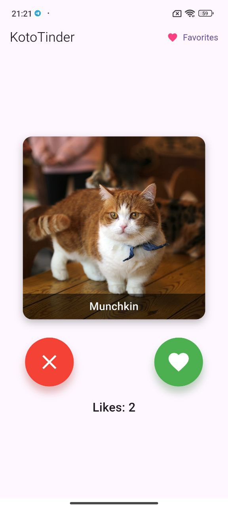
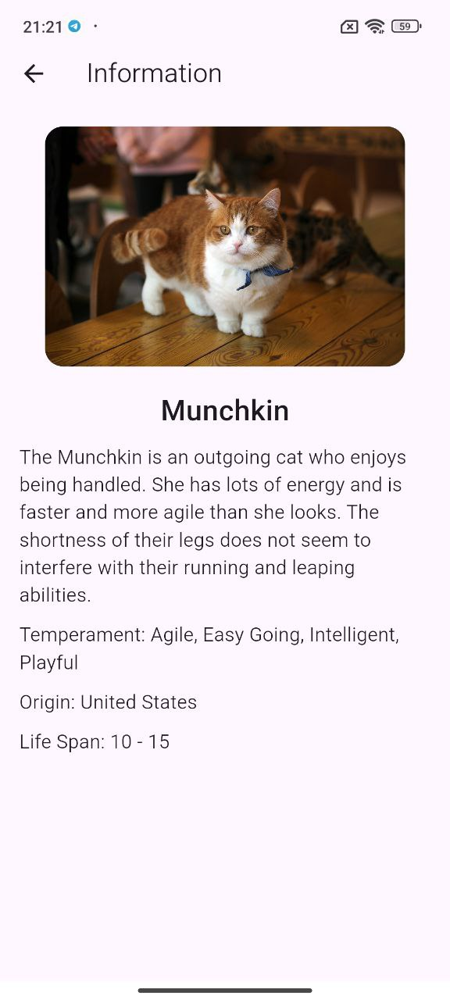
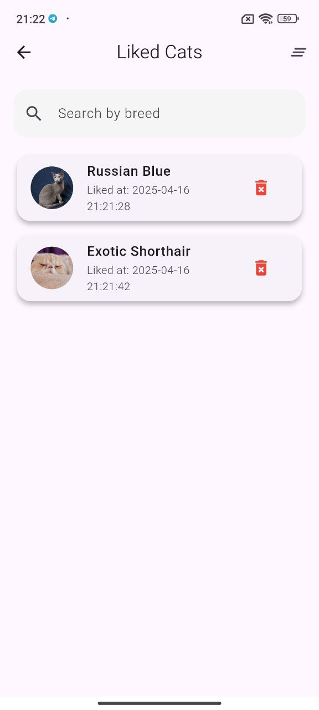
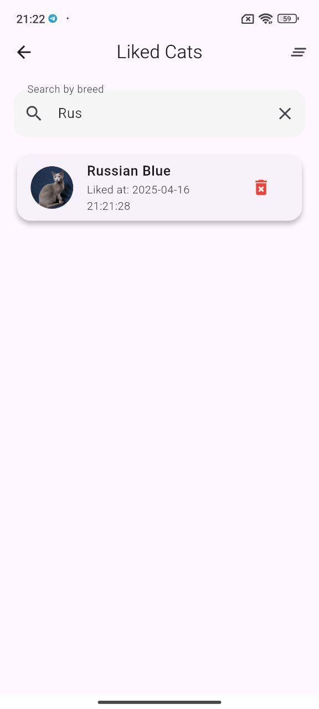

# KotoTinder 🐱

## Описание проекта

KotoTinder - это мобильное приложение в стиле Tinder, но для кошек! Приложение позволяет пользователям просматривать фотографии кошек различных пород, получать информацию о них, а также ставить лайки или пропускать котиков.

Приложение использует [The Cat API](https://thecatapi.com/) для получения изображений и информации о кошках.

## Функциональность

- **Просмотр фотографий котиков** - свайпайте вправо или влево, чтобы лайкнуть или пропустить котика
- **Анимации** - красивые анимации при взаимодействии с интерфейсом
- **Информация о породах** - подробная информация о породе каждого котика
- **Детальная страница** - нажмите на фото, чтобы увидеть подробную информацию о котике
- **Счетчик лайков** - отслеживайте, скольким котикам вы поставили лайк
- **Кэширование изображений** - для быстрой загрузки и экономии трафика
- **Избранные котики** - отслеживайте тех котиков, которым вы поставили лайк
- **Удаление из избранного** - управляйте списком понравившихся котиков
- **Поиск по избранному** - вы можете искать по породам в списке избранных
- **Дата лайка** — вы можете отслеживать время лайка

## Скриншоты

| Основной экран | Детальная информация |
| --- | --- |
|  |  |

| Понравившиеся котики | Поиск по понравившимся |
| --- | --- |
|  |  |

| Ошибка сети | Состояние ошибки |
| --- | --- |
|  |  |

| Индикатор загрузки |
| --- |
|  |

## Технические детали

- Язык программирования: Dart
- Фреймворк: Flutter
- Управление состоянием: StatefulWidget
- API: https://thecatapi.com
- Обработка изображений: cached_network_image
- Управление состоянием: Cubit
- Dependency Injection: Использован get_it
- Загрузка: CircularProgressIndicator как индикатор загрузки изображения
- Диалоги ошибок: AlertDialog при ошибке сети

## Путь до apk файла

